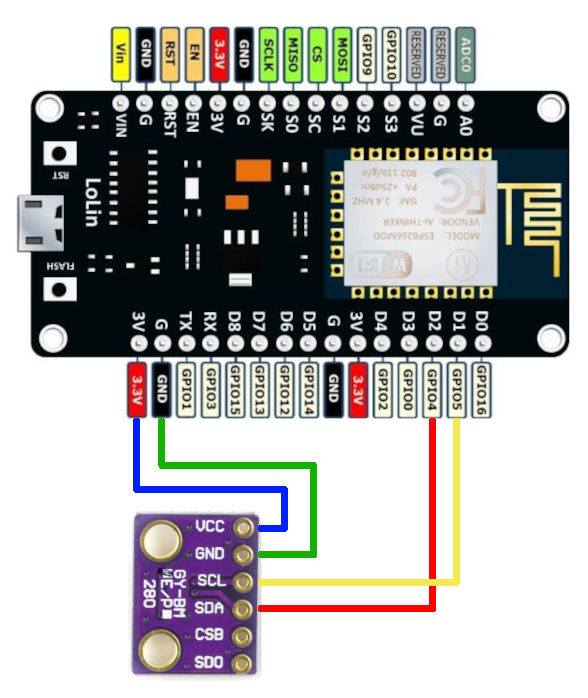

# Home Environment Monitoring System

This project is a home environment monitoring system that tracks temperature, humidity, and pressure in different rooms using ESP8266 boards and BME280 sensors. The system is designed to be lightweight, easy to set up, and accessible to anyone connected to the local Wi-Fi network.

## Overview

The system consists of the following components:

1. **ESP8266 Boards with BME280 Sensors:** 
   - ESP8266 boards are connected to BME280 sensors to measure temperature, humidity, and pressure in different rooms.
   - Each board hosts a simple web server that can be queried for sensor data by devices on the same Wi-Fi network.

2. **Python Data Logging Script:**
   - A Python script runs on a computer connected to the same Wi-Fi network. 
   - It can be used to query the ESP8266 boards according to the configurations specified in a JSON file, for instance using `crontab` or similar tools.
   - The retrieved data is appended to a local CSV file (`sensor_data.csv`), which serves as the database. A portion of the data is then copied into a smaller database to be plotted.

3. **Data Visualization Web Interface:**
   - A Python-based web server hosts an HTML page that reads the data from the CSV file and plots it using Plotly.
   - The page is accessible to any device on the Wi-Fi network and displays individual temperature and humidity plots for each room.

## File Structure

```
sensor-data/
│
├── db/
│   └── sensor_data.csv                 # CSV file containing the complete data
│
├── config.json                         # JSON configuration file with IP addresses of ESP8266 boards
│   
├── src/
│   ├── data_logger.py                  # Python script that queries the sensors and logs data to CSV
│   └── ESP8266_BME280_sender
│       └── ESP8266_BME280_sender.ino   # Arduino code for the board and sensor
│
├── server/
│   ├── index.html                      # Main view HTML page
│   └── data.csv                        # CSV file containing the reduced data to be plotted
│
└── README.md                           # This file
```

## Setup and Usage

### Hardware Setup

1. **General instructions** 
   - Connect the BME280 sensors to the ESP8266 boards according to the followin image 
   
   - Flash the ESP8266 boards with the Arduino code to start the web server and write down each board IP address.
   - Ensure the ESP8266 boards are connected to the same Wi-Fi network as the computer running the Python scripts.
   - Specify the IP addresses of the ESP8266 boards in the `config.json` file.

### Running the System

1. **Start Data Logging:**
   - The `data_logger.py` script is responsible for querying the ESP8266 boards for sensor data and appending it to the `sensor_data.csv` file. To ensure that this script runs automatically at regular intervals, you can set up a cron job.
   - Open the crontab file for editing:
     ```sh
     crontab -e
     ```
   - Add the following line to schedule the script to run every minute:
     ```sh
     * * * * * /usr/bin/python3 /path/to/your/project/sensor-data/src/data_logger.py /path/to/your/project/sensor-data/config.json
     ```
     
2. **Start the Web Server:**
   - Navigate to the `server` directory and start the Python-based web server:
     ```sh
     cd  /path/to/your/project/sensor-data/server
     python -m http.server 8888
     ```
   - Access the web interface by navigating to `http://<your-computer-ip>:8888` in a browser.

### Accessing the Web Interface

Visit `http://<your-computer-ip>:8888/index.html` for temperature and humidity plots.

### Disclaimer

This project was created as a personal experiment in home environment monitoring. ChatGPT was used marginally in this project, mainly for creating the HTML file to display the plots and this README file.

### Credits

Endless source of inspiration and cool projects: [Random Nerd Tutorials](https://randomnerdtutorials.com/)


